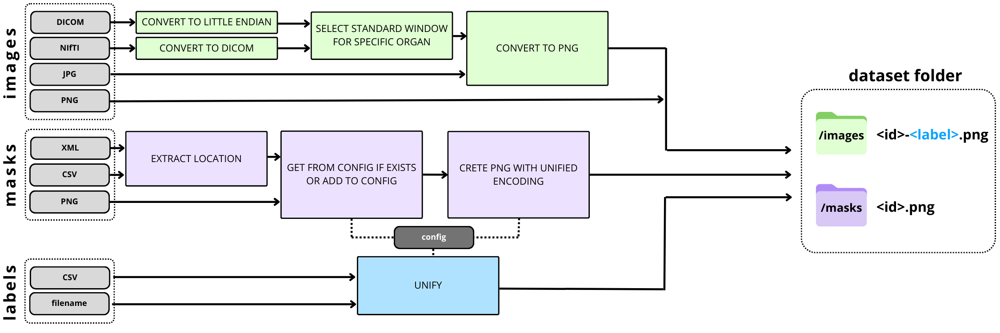

# UMIE_datasets

<!-- Badges -->
<p>
  <a href="https://github.com/TheLion-ai/UMIE_datasets/graphs/contributors">
    
  </a>
  <a href="">
    
  </a>
  <a href="https://creativecommons.org/licenses/by-nc-sa/4.0/">
    
  </a>
  <a hread="https://github.com/TheLion-ai/UMIE_datasets/actions/workflows/python-app.yml">
  
  </a>

</p>


<!-- Table of Contents -->


<!-- About the Project -->
## 🤩 About the Project
```
Warning: This project is currently in alpha stage and may be subject to major changes
```

This repository presents a suite of unified scripts to standardize, preprocess, and integrate 882,774 images from 20 open-source medical imaging datasets, spanning modalities such as X-ray, CT, and MR. The scripts allow for seamless and fast download of a diverse medical data set. We create a unified set of annotations allowing for merging the datasets together without mislabelling. Each dataset is preprocessed with a custom sklearn pipeline. The pipeline steps are reusable across the datasets. The code was designed so that preorocessing a new dataset is simple and requires only reusing the available pipeline steps with customization performed through setting the appropriate values of the pipeline params.

The labels and segmentation masks were unified to be compliant with RadLex ontology.





## Datasets
| uid |                                                                   Dataset                                                                    | Modality |             TASK             |
|:---:|:--------------------------------------------------------------------------------------------------------------------------------------------:|:--------:|:----------------------------:|
|  0  |                                                [KITS-23](https://kits-challenge.org/kits23/)                                                 |    CT    | Classification/Segmentation  |
|  1  |                            [CoronaHack](https://www.kaggle.com/datasets/praveengovi/coronahack-chest-xraydataset)                            |   XRAY   |        Classification        |
|  2  |                    [Alzheimers Dataset](https://www.kaggle.com/datasets/tourist55/alzheimers-dataset-4-class-of-images)	                     |   MRI    |        Classification        |
|  3  |                  [Brain Tumor Classification](https://www.kaggle.com/datasets/sartajbhuvaji/brain-tumor-classification-mri)                  |   MRI    |        Classification        |
|  4  |                    [COVID-19 Detection X-Ray](https://www.kaggle.com/datasets/darshan1504/covid19-detection-xray-dataset)                    |   XRAY   |        Classification        |
|  5  |                  [Finding and Measuring Lungs in CT Data](https://www.kaggle.com/datasets/kmader/finding-lungs-in-ct-data)	                 |    CT    |         Segmentation         |
|  6  |       [Brain CT Images with Intracranial Hemorrhage Masks](https://www.kaggle.com/datasets/vbookshelf/computed-tomography-ct-images)	       |    CT    |        Classification        |
|  7  |                           [Liver and Liver Tumor Segmentation](https://www.kaggle.com/datasets/andrewmvd/lits-png)                           |    CT    | Classification, Segmentation |
|  8  |      [Brain MRI Images for Brain Tumor Detection](https://www.kaggle.com/datasets/jjprotube/brain-mri-images-for-brain-tumor-detection)      |   MRI    |        Classification        |
|  9  | [Knee Osteoarthritis Dataset with Severity Grading](https://www.kaggle.com/datasets/shashwatwork/knee-osteoarthritis-dataset-with-severity)	 |   XRAY   |        Classification        |
| 10  |                     [Brain Tumor Progression](https://www.cancerimagingarchive.net/collection/brain-tumor-progression/)                      |   MRI    |         Segmentation         |
| 11  |                               [Chest X-ray 14](https://nihcc.app.box.com/v/ChestXray-NIHCC/folder/36938765345)                               |   XRAY   |        Classification        |
| 12  |         [COCA- Coronary Calcium and chest CTs](https://stanfordaimi.azurewebsites.net/datasets/e8ca74dc-8dd4-4340-815a-60b41f6cb2aa)         |    CT    |         Segmentation         |
| 13  |                                           [BrainMetShare](https://aimi.stanford.edu/brainmetshare)                                           |   MRI    |         Segmentation         |
| 14  |                                      [CT-ORG](https://www.cancerimagingarchive.net/collection/ct-org/)                                       |    CT    |         Segmentation         |
| 17  |                                   [LIDC-IDRI](https://www.cancerimagingarchive.net/collection/lidc-idri/)                                    |    CT    |         Segmentation         |
| 18  |                                        [CMMD](https://www.cancerimagingarchive.net/collection/cmmd/)                                         |    MG    |        Classification        |


# **Using the datasets**
## Installing requirements
```bash
poetry install
```
## Creating the dataset
Due to the copyright restrictions of the source datasets, we can't share the files directly. To obtain the full dataset you have to download the source datasets yourself and run the preprocessing scripts.
<details>
  <summary>0.KITS-23</summary>

  ### KITS-23

  1. Clone the [KITS-23 repository](https://github.com/neheller/kits23).
  2. Enter the KITS-23 directory and install the packages with pip.
        ```bash
        cd kits23
        pip3 install -e .
        ```
  3. Run the following command to download the data to the `dataset/` folder.
        ```
        kits23_download_data
        ```
  4. Fill in the `source_path` and `target_path` `KITS-23Pipeline()` in `config/runner_config.py`.
        e.g.
        ```python
         KITS23Pipeline(
              path_args={
                  "source_path": "kits23/dataset",  # Path to the dataset directory in KITS23 repo
                  "target_path": TARGET_PATH,
                  "labels_path": "kits23/dataset/kits23.json",  # Path to kits23.json
              },
              dataset_args=dataset_config.KITS23
          ),
        ```

</details>
<details>
  <summary>1. Xray CoronaHack -Chest X-Ray-Dataset</summary>

**1. Xray CoronaHack -Chest X-Ray-Dataset**
  1. Go to [CoronaHack](https://www.kaggle.com/datasets/praveengovi/coronahack-chest-xraydataset) page on Kaggle.
  2. Login to your Kaggle account.
  3. Download the data.
  4. Extract `archive.zip`.
  5. Fill in the `source_path` to the location of the `archive` folder in `CoronaHackPipeline()` in `config/runner_config.py`.

</details>
<details>
  <summary>2. Alzheimer's Dataset</summary>

**2. Alzheimer's Dataset ( 4 class of Images)**
1. Go to [Alzheimer's Dataset](https://www.kaggle.com/datasets/tourist55/alzheimers-dataset-4-class-of-images) page on Kaggle.
2. Login to your Kaggle account.
3. Download the data.
4. Extract `archive.zip`.
5. Fill in the `source_path` to the location of the `archive` folder in `AlzheimersPipeline()` in `config/runner_config.py`.

</details>


<details>
  <summary>3. Brain Tumor Classification (MRI</summary>

**3. Brain Tumor Classification (MRI)**
1. Go to [Brain Tumor Classification](https://www.kaggle.com/datasets/masoudnickparvar/brain-tumor-mri-dataset) page on Kaggle.
  2. Login to your Kaggle account.
  3. Download the data.
  4. Extract `archive.zip`.
  5. Fill in the `source_path` to the location of the `archive` folder in `BrainTumorClassificationPipeline()` in `config/runner_config.py`.

</details>

<details>
  <summary>4. COVID-19 Detection X-Ray</summary>

**4. COVID-19 Detection X-Ray**
  1. Go to [COVID-19 Detection X-Ray](https://www.kaggle.com/datasets/darshan1504/covid19-detection-xray-dataset) page on Kaggle.
  2. Login to your Kaggle account.
  3. Download the data.
  4. Extract `archive.zip`.
  5. REMOVE **TrainData** folder. We do not want augmented data at this stage.
  5. Fill in the `source_path` to the location of the `archive` folder in `COVID19DetectionPipeline()` in `config/runner_config.py`.

</details>

<details>
  <summary>5. Finding and Measuring Lungs in CT Dat</summary>

**5. Finding and Measuring Lungs in CT Data**
  1.  Go to [Finding and Measuring Lungs in CT Data](https://www.kaggle.com/datasets/kmader/finding-lungs-in-ct-data) page on Kaggle.
  2. Login to your Kaggle account.
  3. Download the data.
  4. Extract `archive.zip`.
  5. Fill in the `source_path` to the location of the `archive/2d_images` folder in `FindingAndMeasuringLungsPipeline()` in `config/runner_config.py`. Fill in `masks_path` with the location of the `archive/2d_masks` folder.

</details>

<details>
  <summary>6. Brain CT Images with Intracranial Hemorrhage Masks</summary>

**6. Brain CT Images with Intracranial Hemorrhage Masks**
  1. Go to [Brain With Intracranial Hemorrhage](https://www.kaggle.com/datasets/vbookshelf/computed-tomography-ct-images) page on Kaggle.
  2. Login to your Kaggle account.
  3. Download the data.
  4. Extract `archive.zip`.
  5. Fill in the `source_path` to the location of the `archive` folder in `BrainWithIntracranialHemorrhagePipeline()` in `config/runner_config.py`. Fill in `masks_path` with the same path as the `source_path`.

</details>

<details>
  <summary>7. Liver and Liver Tumor Segmentation (LITS)</summary>

**7. Liver and Liver Tumor Segmentation (LITS)**
  1. Go to   [Liver and Liver Tumor Segmentation](https://www.kaggle.com/datasets/andrewmvd/lits-png).
  2. Login to your Kaggle account.
  3. Download the data.
  4. Extract `archive.zip`.
  5. Fill in the `source_path` to the location of the `archive` folder in `COVID19DetectionPipeline()` in `config/runner_config.py`. Fill in `masks_path` too.

</details>

<details>
  <summary>8. Brain MRI Images for Brain Tumor Detection</summary>

**8. Brain MRI Images for Brain Tumor Detection**
  1. Go to [Brain MRI Images for Brain Tumor Detection](https://www.kaggle.com/datasets/jjprotube/brain-mri-images-for-brain-tumor-detection) page on Kaggle.
  2. Login to your Kaggle account.
  3. Download the data.
  4. Extract `archive.zip`.
  5. Fill in the `source_path` to the location of the `archive` folder in `BrainTumorDetectionPipeline()` in `config/runner_config.py`.

</details>

<details>
  <summary>9. Knee Osteoarthrithis Dataset with Severity Grading</summary>

**9. Knee Osteoarthrithis Dataset with Severity Grading**
    1. Go to [Knee Osteoarthritis Dataset with Severity Grading](https://www.kaggle.com/datasets/shashwatwork/knee-osteoarthritis-dataset-with-severity).
    2. Login to your Kaggle account.
    3. Download the data.
    4. Extract `archive.zip`.
    5. Fill in the `source_path` to the location of the `archive` folder in `COVID19DetectionPipeline()` in `config/runner_config.py`.

</details>


<details>
  <summary>10. Brain-Tumor-Progression</summary>

**10. Brain-Tumor-Progression**
  **UPDATE: Some data in this collection contains images that could potentially be used to reconstruct a human face. The data collection is removed.**
  1. Go to [Brain Tumor Progression](https://wiki.cancerimagingarchive.net/display/Public/Brain-Tumor-Progression#339481190e2ccc0d07d7455ab87b3ebb625adf48) dataset from the cancer imaging archive.

</details>

<details>
  <summary>11. Chest X-ray 14</summary>

**11. Chest X-ray 14**
  1. Go to [Chest X-ray 14](https://nihcc.app.box.com/v/ChestXray-NIHCC/folder/36938765345).
  2. Create an account.
  3. Download the `images` folder and `DataEntry2017_v2020.csv`.

</details>


<details>
  <summary>12. COCA- Coronary Calcium and chest CTs</summary>

**12. COCA- Coronary Calcium and chest CTs**
  1. Go to [COCA- Coronary Calcium and chest CTs](https://stanfordaimi.azurewebsites.net/datasets/e8ca74dc-8dd4-4340-815a-60b41f6cb2aa).
  2. Log in or sign up for a Stanford AIMI account.
  3. Fill in your contact details.
  4. Download the data with [azcopy](https://learn.microsoft.com/en-us/azure/storage/common/storage-use-azcopy-v10).
  5. Fill in the `source_path` with the location of the `cocacoronarycalciumandchestcts-2/Gated_release_final/patient` folder. Fill in `masks_path` with `cocacoronarycalciumandchestcts-2/Gated_release_final/calcium_xml` xml file.
</details>


<details>
  <summary>13. BrainMetShare</summary>

**13. BrainMetShare**
  1. Go to [BrainMetShare](https://aimi.stanford.edu/brainmetshare).
  2. Log in or sign up for a Stanford AIMI account.
  3. Fill in your contact details.
  4. Download the data with [azcopy](https://learn.microsoft.com/en-us/azure/storage/common/storage-use-azcopy-v10).
</details>


<details>
  <summary>14. CT-ORG</summary>

**14. CT-ORG**
  1. Go to [CT-ORG](https://www.cancerimagingarchive.net/collection/ct-org/) page on Cancer imaging archive.
  2. Download the data.
  3. Extract `PKG - CT-ORG`.
  4. Fill in the `source_path` to the location of the `OrganSegmentations` folder in `CtOrgPipeline()` in `config/runner_config.py`. Fill in `masks_path` with the same path as the `source_path`.
</details>


<details>
  <summary>17. LIDC-IDRI</summary>

**17. LIDC-IDRI**
  1. Go to [LIDC-IDRI](https://www.cancerimagingarchive.net/collection/lidc-idri/).
  2. Download "Images" using [NBIA Data Retriever](https://wiki.cancerimagingarchive.net/display/NBIA/Downloading+TCIA+Images), and "Radiologist Annotations/Segmentations".
  3. Extract `LIDC-XML-only.zip`.
  4. Fill in the `source_path` in `CmmdPipeline()` in `config/runner_config.py` with the location of the `manifest-{xxxxxxxxxxxxx}/LIDC-IDRI` directory.
  5. Fill in the `masks_path` in `CmmdPipeline()` in `config/runner_config.py` with the location of the `LIDC-XML-only/` directory.

   ```
      Data Citation
      Armato III, S. G., McLennan, G., Bidaut, L., McNitt-Gray, M. F., Meyer, C. R., Reeves, A. P., Zhao, B., Aberle, D. R., Henschke, C. I., Hoffman, E. A., Kazerooni, E. A., MacMahon, H., Van Beek, E. J. R., Yankelevitz, D., Biancardi, A. M., Bland, P. H., Brown, M. S., Engelmann, R. M., Laderach, G. E., Max, D., Pais, R. C. , Qing, D. P. Y. , Roberts, R. Y., Smith, A. R., Starkey, A., Batra, P., Caligiuri, P., Farooqi, A., Gladish, G. W., Jude, C. M., Munden, R. F., Petkovska, I., Quint, L. E., Schwartz, L. H., Sundaram, B., Dodd, L. E., Fenimore, C., Gur, D., Petrick, N., Freymann, J., Kirby, J., Hughes, B., Casteele, A. V., Gupte, S., Sallam, M., Heath, M. D., Kuhn, M. H., Dharaiya, E., Burns, R., Fryd, D. S., Salganicoff, M., Anand, V., Shreter, U., Vastagh, S., Croft, B. Y., Clarke, L. P. (2015). Data From LIDC-IDRI [Data set]. The Cancer Imaging Archive. https://doi.org/10.7937/K9/TCIA.2015.LO9QL9SX
  ```

</details>


<details>
  <summary>18. CMMD - The Chinese Mammography Database</summary>

**18. CMMD**
  1. Go to [CMMD](https://www.cancerimagingarchive.net/collection/cmmd/).
  2. Download .tcia file from Data Access table.
  3. Download [NBIA Data Retriver](https://wiki.cancerimagingarchive.net/display/NBIA/Downloading+TCIA+Images) to be able to download images.
  4. Download CMMD_clinicaldata_revision.xlsx from Data Access table for labels information.
  5. Fill in the `source_path` in `CmmdPipeline()` in `config/runner_config.py` with the location of the `manifest-{xxxxxxxxxxxxx}/CMMD` folder.
  6. Fill in the `labels_path` in `CmmdPipeline()` in `config/runner_config.py` with the location of the `CMMD_clinicaldata_revision.xlsx` file.


   ```
      Data Citation
      ui, Chunyan; Li Li; Cai, Hongmin; Fan, Zhihao; Zhang, Ling; Dan, Tingting; Li, Jiao; Wang, Jinghua. (2021) The Chinese Mammography Database (CMMD): An online mammography database with biopsy confirmed types for machine diagnosis of breast. The Cancer Imaging Archive. DOI: https://doi.org/10.7937/tcia.eqde-4b16
  ```
</details>


To preprocess the dataset that is not among the above, search the preprocessing folder. It contains the reusable steps for changing imaging formats, extracting masks, creating file trees, etc. Go to the config file to check which masks and label encodings are available. Append new labels and mask encodings if needed.

Overall the dataset should have **882,774** images in **.png** format
* **CT - 500k+**
* **X-Ray - 250k+**
* **MRI - 100k+**

## 🎯 Roadmap
- [X] dcm
- [x] jpg
- [x] nii
- [x] tif
- [x] Shared radlex ontology
- [ ] Huggingface datasets
- [ ] Data dashboards


<!-- Contributing -->
## :wave: Contributors

<a href="https://github.com/TheLion-ai/UMIE_datasets/graphs/contributors">
  
</a>

<!-- Contact -->
## :handshake: Contact

[Barbara Klaudel](https://www.linkedin.com/in/barbara-klaudel/)

[TheLion.AI](https://www.linkedin.com/company/53394525/)


# Development
## Pre-commits
Install pre-commits
https://pre-commit.com/#installation

If you are using VS-code install the extention https://marketplace.visualstudio.com/items?itemName=MarkLarah.pre-commit-vscode

To make a dry-run of the pre-commits to see if your code passes run
```
pre-commit run --all-files
```


## Adding python packages
Dependencies are handeled by `poetry` framework, to add new dependency run
```
poetry add <package_name>
```

## Debugging

To modify and debug the app, [development in containers](https://davidefiocco.github.io/debugging-containers-with-vs-code) can be useful .

## Testing
```bash
run_tests.sh
```
